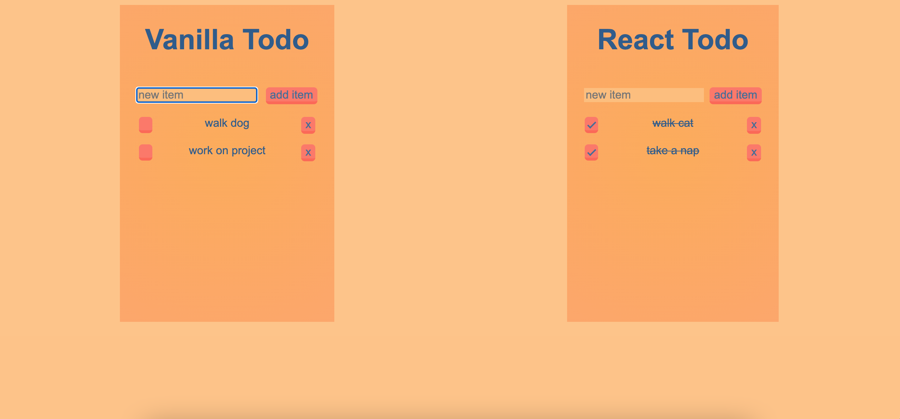

# Plenty Todo
Two of the same todo application written in JavaScript and React.



## Installation
1. Clone repo by running `git clone https://github.com/simonxcode/todo-refresher.git`

2. Install dependencies  
`npm install` or `yarn install`

3. Run application in development mode  
> **note:** I used [Live Server](https://marketplace.visualstudio.com/items?itemName=ritwickdey.LiveServer) for deployment. Setting up [Tasks](https://stackoverflow.com/a/30043507/10277395) is another option.

## Contribute
1. Create your feature branch  
`git checkout -b feature/fooBar` 
> **note:** in order to see changes in React Todo execute `yarn babel --watch src --out-dir . --presets react-app/prod` Babel watcher. More information can be found here: https://reactjs.org/docs/add-react-to-a-website.html#run-jsx-preprocessor

2. Add and commit your changes 
```
git add .
git commit -m "changes made with fooBar"
```

3. Push to origin   
`git push origin feature/fooBar`

4. Create a new Pull Request 

## License
This project is open source and available under the [MIT License](LICENSE). 


